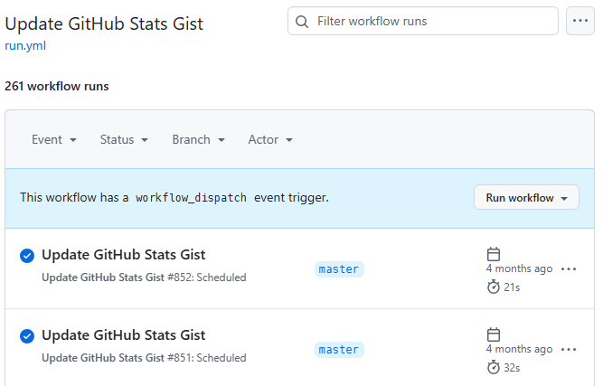

## Github Action은 왜 멈출까

필요하지 않은 workflow가 작동하는 걸 방지하기 위해, Github은 해당 레포에 60일간 커밋이 생기지 않으면 크론 작업을 비활성화한다고 한다. [공식문서](https://docs.github.com/ko/actions/managing-workflow-runs-and-deployments/managing-workflow-runs/disabling-and-enabling-a-workflow)

나의 경우, Gist를 업데이트해서 Github 프로필을 꾸미는 [productive-box](https://github.com/techinpark/productive-box)와 [github-stats-box](https://github.com/bokub/github-stats-box)를 사용하고 있다.  
이 두 레포지토리는 커밋이 생길리가 없기 때문에... 매번 수동으로 workflow를 enable 해줘야 한다는 단점이 있었다.

오늘도 마침 프로필에 들어갔다 업데이트가 멈춘 Gist를 발견했고 _이걸 또 켜야해?_ 라는 생각이 들어서 계속 활성화 할 수 있는 방법이 없는지 알아보았다.

## keepalive-workflow

이 [workflow](https://github.com/gautamkrishnar/keepalive-workflow)는 45일간 커밋이 없을 시에 Github API를 이용하거나, 더미 커밋을 생성해서 workflow가 계속 활성화될 수 있도록 한다.

### 방법1 : 내 워크플로우에 step 추가

```yml
name: Github Action with a cronjob trigger
on:
  schedule:
    - cron: '0 0 * * *'
permissions:
  actions: write
jobs:
  cronjob-based-github-action:
    name: Cronjob based github action
    runs-on: ubuntu-latest
    steps:
      - uses: actions/checkout@v4
      # - step 2
      # - step n, use it as the last step
      - uses: gautamkrishnar/keepalive-workflow@v2 # using the workflow with default settings
```

마지막 스텝으로 keepalive-workflow를 추가한다.  
다만 이 방법은 내가 실행하는 workflow가 여러개일 경우에 매번 추가해야 한다는 단점이 있다.

<details>
<summary>별도 job으로 분리도 가능</summary>

```yml
name: Github Action with a cronjob trigger
on:
  schedule:
    - cron: '0 0 * * *'
jobs:
  main-job:
    name: Main Job
    runs-on: ubuntu-latest
    steps:
      - uses: actions/checkout@v4
      # - step1
      # - step 2
      # - Step N
  keepalive-job:
    name: Keepalive Workflow
    runs-on: ubuntu-latest
    permissions:
      actions: write
    steps:
      - uses: actions/checkout@v4
      - uses: gautamkrishnar/keepalive-workflow@v2
```

</details>
<br>

### 방법2: 별도 workflow로 분리

```yml
name: Keepalive Workflow
on:
  schedule:
    - cron: '0 0 * * *'
permissions:
  actions: write
jobs:
  cronjob-based-github-action:
    name: Keepalive Workflow
    runs-on: ubuntu-latest
    steps:
      - uses: actions/checkout@v4
      - uses: gautamkrishnar/keepalive-workflow@v2
        with:
          workflow_files: 'build1.yml, build2.yml'
          time_elapsed: '0'
```

workflow_files에 크론잡이 수행되는 workflow의 이름을 추가해서 관리할 수 있다.

```yml
on:
  push:
    branches:
      - master
  schedule:
    - cron: '0 0 * * *'
```

내 [github-stats-box](https://github.com/minjj0905/github-stats-box) 레포지토리에 해당 workflow를 추가하고 push 시에도 작동하도록 추가해서 action이 실행되는 것을 확인해보았다.

  
API를 통해 정상 작동 하였고

  
4개월전에 disabled 된 내 workflow가 enable 되었다! 😸

같은 증상으로 고민하던 분들이 있다면 한번 적용해보시면 좋을 것 같다.
